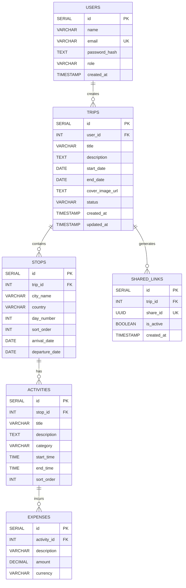
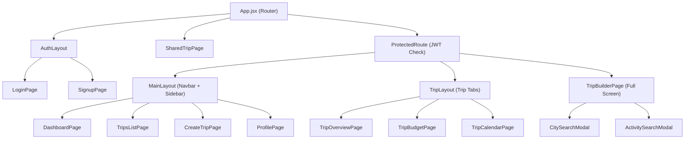
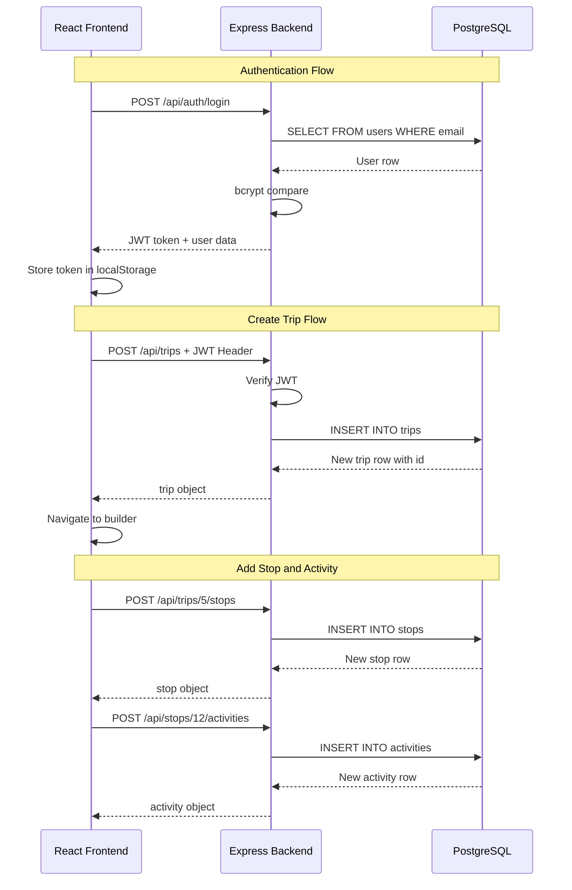

# 🏗️ GlobeTrotter - System Architecture

> **Odoo x LDCE Hackathon 2026** | Travel Planning Application
> This document defines the full-stack architecture. Each team member should read their section and start building independently.

---

## 📌 Tech Stack

| Layer        | Technology                          | Owner           |
|------------- |-------------------------------------|-----------------|
| **Frontend** | React (Vite) + React Router v6      | 🎨 Frontend Dev |
| **Backend**  | Node.js + Express.js                | ⚙️ Backend Dev  |
| **Database** | PostgreSQL (local via pgAdmin/XAMPP) | 🗄️ Database Dev |
| **Auth**     | JWT (JSON Web Tokens) + bcrypt      | ⚙️ Backend Dev  |
| **Styling**  | CSS Modules / Vanilla CSS           | 🎨 Frontend Dev |

---

## 🗂️ Monorepo Folder Structure

```
globeTrotter/
├── client/                     # 🎨 FRONTEND (React + Vite)
│   ├── public/
│   ├── src/
│   │   ├── assets/             # Images, icons, fonts
│   │   ├── components/         # Reusable UI components
│   │   │   ├── Navbar.jsx
│   │   │   ├── TripCard.jsx
│   │   │   ├── BudgetChart.jsx
│   │   │   ├── CalendarView.jsx
│   │   │   ├── CitySearchModal.jsx
│   │   │   ├── ActivitySearchModal.jsx
│   │   │   ├── ProtectedRoute.jsx
│   │   │   └── LoadingSpinner.jsx
│   │   ├── layouts/            # Layout wrappers
│   │   │   ├── MainLayout.jsx      # Navbar + Sidebar wrapper
│   │   │   ├── TripLayout.jsx      # Trip tabs (Overview/Budget/Calendar)
│   │   │   ├── AdminLayout.jsx     # Admin dashboard wrapper
│   │   │   └── AuthLayout.jsx      # Minimal layout for login/signup
│   │   ├── pages/              # Route-level page components
│   │   │   ├── LoginPage.jsx
│   │   │   ├── SignupPage.jsx
│   │   │   ├── DashboardPage.jsx
│   │   │   ├── TripsListPage.jsx
│   │   │   ├── CreateTripPage.jsx
│   │   │   ├── TripOverviewPage.jsx
│   │   │   ├── TripBudgetPage.jsx
│   │   │   ├── TripCalendarPage.jsx
│   │   │   ├── TripBuilderPage.jsx
│   │   │   ├── SharedTripPage.jsx
│   │   │   ├── ProfilePage.jsx
│   │   │   ├── AdminPage.jsx
│   │   │   └── NotFoundPage.jsx
│   │   ├── services/           # API call functions
│   │   │   ├── api.js              # Axios instance with base URL + interceptors
│   │   │   ├── authService.js
│   │   │   ├── tripService.js
│   │   │   ├── stopService.js
│   │   │   ├── activityService.js
│   │   │   └── shareService.js
│   │   ├── context/            # React Context for global state
│   │   │   └── AuthContext.jsx
│   │   ├── hooks/              # Custom hooks
│   │   │   └── useAuth.js
│   │   ├── utils/              # Helper functions
│   │   ├── App.jsx             # Router setup
│   │   ├── main.jsx            # Entry point
│   │   └── index.css           # Global styles
│   ├── package.json
│   └── vite.config.js
│
├── server/                     # ⚙️ BACKEND (Node.js + Express)
│   ├── config/
│   │   └── db.js               # PostgreSQL connection pool (pg)
│   ├── middleware/
│   │   ├── authMiddleware.js   # JWT verification middleware
│   │   └── validate.js         # Input validation middleware
│   ├── controllers/            # Business logic
│   │   ├── authController.js
│   │   ├── tripController.js
│   │   ├── stopController.js
│   │   ├── activityController.js
│   │   ├── budgetController.js
│   │   └── shareController.js
│   ├── routes/                 # Express route definitions
│   │   ├── authRoutes.js
│   │   ├── tripRoutes.js
│   │   ├── stopRoutes.js
│   │   ├── activityRoutes.js
│   │   └── shareRoutes.js
│   ├── utils/
│   │   └── generateToken.js
│   ├── server.js               # Express app entry point
│   └── package.json
│
├── database/                   # 🗄️ DATABASE (PostgreSQL)
│   ├── schema.sql              # CREATE TABLE statements (run this first)
│   ├── seed.sql                # Sample/test data inserts
│   └── erd.png                 # Entity-Relationship Diagram image
│
├── ARCHITECTURE.md             # ← You are here
├── ROUTES.md
├── PROBLEM_STATEMENT.md
├── Odoo_Hackathon_Context.md
└── README.md
```

---

## 🗄️ Database Architecture (Database Dev)

### Entity-Relationship Diagram



### SQL Schema (`database/schema.sql`)

```sql
-- Run this file first to create all tables

CREATE TABLE users (
    id SERIAL PRIMARY KEY,
    name VARCHAR(100) NOT NULL,
    email VARCHAR(150) UNIQUE NOT NULL,
    password_hash TEXT NOT NULL,
    role VARCHAR(20) DEFAULT 'user',
    created_at TIMESTAMP DEFAULT CURRENT_TIMESTAMP
);

CREATE TABLE trips (
    id SERIAL PRIMARY KEY,
    user_id INT NOT NULL REFERENCES users(id) ON DELETE CASCADE,
    title VARCHAR(200) NOT NULL,
    description TEXT,
    start_date DATE,
    end_date DATE,
    cover_image_url TEXT,
    status VARCHAR(20) DEFAULT 'draft',
    created_at TIMESTAMP DEFAULT CURRENT_TIMESTAMP,
    updated_at TIMESTAMP DEFAULT CURRENT_TIMESTAMP
);

CREATE TABLE stops (
    id SERIAL PRIMARY KEY,
    trip_id INT NOT NULL REFERENCES trips(id) ON DELETE CASCADE,
    city_name VARCHAR(200) NOT NULL,
    country VARCHAR(100),
    day_number INT,
    sort_order INT DEFAULT 0,
    arrival_date DATE,
    departure_date DATE
);

CREATE TABLE activities (
    id SERIAL PRIMARY KEY,
    stop_id INT NOT NULL REFERENCES stops(id) ON DELETE CASCADE,
    title VARCHAR(200) NOT NULL,
    description TEXT,
    category VARCHAR(50),
    start_time TIME,
    end_time TIME,
    sort_order INT DEFAULT 0
);

CREATE TABLE expenses (
    id SERIAL PRIMARY KEY,
    activity_id INT NOT NULL REFERENCES activities(id) ON DELETE CASCADE,
    description VARCHAR(200),
    amount DECIMAL(10, 2) NOT NULL DEFAULT 0,
    currency VARCHAR(10) DEFAULT 'INR'
);

CREATE TABLE shared_links (
    id SERIAL PRIMARY KEY,
    trip_id INT NOT NULL REFERENCES trips(id) ON DELETE CASCADE,
    share_id UUID UNIQUE NOT NULL DEFAULT gen_random_uuid(),
    is_active BOOLEAN DEFAULT true,
    created_at TIMESTAMP DEFAULT CURRENT_TIMESTAMP
);

-- Indexes for performance
CREATE INDEX idx_trips_user_id ON trips(user_id);
CREATE INDEX idx_stops_trip_id ON stops(trip_id);
CREATE INDEX idx_activities_stop_id ON activities(stop_id);
CREATE INDEX idx_expenses_activity_id ON expenses(activity_id);
CREATE INDEX idx_shared_links_share_id ON shared_links(share_id);
```

### Database Dev Responsibilities

| Priority | Task                                          |
|----------|-----------------------------------------------|
| 🔴 P0   | Install PostgreSQL locally, create `globetrotter_db` database |
| 🔴 P0   | Run `schema.sql` to create all 6 tables       |
| 🟡 P1   | Write `seed.sql` with sample users, trips, stops, activities, expenses |
| 🟡 P1   | Create the ERD diagram image (`erd.png`)       |
| 🟢 P2   | Write & test complex queries (budget aggregation, trip listing with counts) |
| 🟢 P2   | Optimize with indexes (already included above) |

---

## ⚙️ Backend Architecture (Backend Dev)

### API Endpoints Contract

All endpoints return JSON. Base URL: `http://localhost:5000/api`

#### 🔓 Auth Routes (`/api/auth`)

| Method | Endpoint           | Body                               | Response               | Description          |
|--------|--------------------|-------------------------------------|------------------------|----------------------|
| POST   | `/api/auth/signup`  | `{ name, email, password }`        | `{ token, user }`      | Register new user    |
| POST   | `/api/auth/login`   | `{ email, password }`              | `{ token, user }`      | Login, returns JWT   |
| GET    | `/api/auth/me`      | —                                  | `{ user }`             | Get current user (requires token) |

#### 🧳 Trip Routes (`/api/trips`) — *Auth Required*

| Method | Endpoint              | Body / Params                      | Response               | Description          |
|--------|-----------------------|-------------------------------------|------------------------|----------------------|
| GET    | `/api/trips`          | —                                  | `[ trips ]`            | Get all trips for logged-in user |
| POST   | `/api/trips`          | `{ title, description, start_date, end_date, cover_image_url }` | `{ trip }` | Create a new trip |
| GET    | `/api/trips/:id`      | —                                  | `{ trip, stops, activities, expenses }` | Get full trip details |
| PUT    | `/api/trips/:id`      | `{ title, description, ... }`      | `{ trip }`             | Update trip metadata |
| DELETE | `/api/trips/:id`      | —                                  | `{ message }`          | Delete a trip (cascades) |

#### 📍 Stop Routes (`/api/trips/:tripId/stops`) — *Auth Required*

| Method | Endpoint                          | Body                                | Response     |
|--------|-----------------------------------|--------------------------------------|--------------|
| GET    | `/api/trips/:tripId/stops`        | —                                   | `[ stops ]`  |
| POST   | `/api/trips/:tripId/stops`        | `{ city_name, country, day_number, arrival_date, departure_date }` | `{ stop }` |
| PUT    | `/api/trips/:tripId/stops/:id`    | `{ city_name, sort_order, ... }`    | `{ stop }`   |
| DELETE | `/api/trips/:tripId/stops/:id`    | —                                   | `{ message }`|

#### 🎯 Activity Routes (`/api/stops/:stopId/activities`) — *Auth Required*

| Method | Endpoint                               | Body                                | Response         |
|--------|----------------------------------------|--------------------------------------|------------------|
| GET    | `/api/stops/:stopId/activities`        | —                                   | `[ activities ]` |
| POST   | `/api/stops/:stopId/activities`        | `{ title, description, category, start_time, end_time }` | `{ activity }` |
| PUT    | `/api/stops/:stopId/activities/:id`    | `{ title, category, ... }`          | `{ activity }`   |
| DELETE | `/api/stops/:stopId/activities/:id`    | —                                   | `{ message }`    |

#### 💰 Budget Route (`/api/trips/:tripId/budget`) — *Auth Required*

| Method | Endpoint                      | Response                                          |
|--------|-------------------------------|---------------------------------------------------|
| GET    | `/api/trips/:tripId/budget`   | `{ total, by_stop: [{ city, total, expenses }] }` |

#### 🔗 Share Routes (`/api/share`)

| Method | Endpoint                      | Auth?    | Response                       |
|--------|-------------------------------|----------|--------------------------------|
| POST   | `/api/share/:tripId`          | ✅ Yes   | `{ shareId, link }`            |
| GET    | `/api/share/:shareId`         | ❌ No    | `{ trip, stops, activities }`  |
| POST   | `/api/share/:shareId/clone`   | ✅ Yes   | `{ newTripId }`                |

### Backend Dev Responsibilities

| Priority | Task                                          |
|----------|-----------------------------------------------|
| 🔴 P0   | Scaffold Express app, connect to PostgreSQL using `pg` pool |
| 🔴 P0   | Build Auth routes (signup/login with bcrypt + JWT) |
| 🔴 P0   | Build Trip CRUD routes with auth middleware    |
| 🟡 P1   | Build Stop + Activity CRUD routes             |
| 🟡 P1   | Build Budget aggregation endpoint             |
| 🟡 P1   | Build Share routes (generate link, public view, clone trip) |
| 🟢 P2   | Input validation on all endpoints             |
| 🟢 P2   | Error handling middleware (consistent JSON errors) |

### Express Server Boilerplate (`server/server.js`)

```javascript
const express = require('express');
const cors = require('cors');

const authRoutes = require('./routes/authRoutes');
const tripRoutes = require('./routes/tripRoutes');
const stopRoutes = require('./routes/stopRoutes');
const activityRoutes = require('./routes/activityRoutes');
const shareRoutes = require('./routes/shareRoutes');

const app = express();
const PORT = process.env.PORT || 5000;

app.use(cors());
app.use(express.json());

// Routes
app.use('/api/auth', authRoutes);
app.use('/api/trips', tripRoutes);
app.use('/api/stops', stopRoutes);
app.use('/api/share', shareRoutes);

// Global error handler
app.use((err, req, res, next) => {
    console.error(err.stack);
    res.status(500).json({ error: 'Internal Server Error' });
});

app.listen(PORT, () => console.log(`Server running on port ${PORT}`));
```

---

## 🎨 Frontend Architecture (Frontend Dev)

### Routing Map (`App.jsx`)

```jsx
<BrowserRouter>
  <Routes>
    {/* Public Routes */}
    <Route element={<AuthLayout />}>
      <Route path="/login" element={<LoginPage />} />
      <Route path="/signup" element={<SignupPage />} />
    </Route>
    <Route path="/share/:shareId" element={<SharedTripPage />} />

    {/* Protected Routes */}
    <Route element={<ProtectedRoute />}>
      <Route element={<MainLayout />}>
        <Route path="/" element={<DashboardPage />} />
        <Route path="/dashboard" element={<DashboardPage />} />
        <Route path="/trips" element={<TripsListPage />} />
        <Route path="/trips/create" element={<CreateTripPage />} />
        <Route path="/profile" element={<ProfilePage />} />
      </Route>

      <Route element={<TripLayout />}>
        <Route path="/trips/:id" element={<TripOverviewPage />} />
        <Route path="/trips/:id/budget" element={<TripBudgetPage />} />
        <Route path="/trips/:id/calendar" element={<TripCalendarPage />} />
      </Route>

      <Route path="/trips/:id/builder" element={<TripBuilderPage />} />

      <Route element={<AdminLayout />}>
        <Route path="/admin" element={<AdminPage />} />
      </Route>
    </Route>

    {/* 404 */}
    <Route path="*" element={<NotFoundPage />} />
  </Routes>
</BrowserRouter>
```

### Component Hierarchy



### Frontend Dev Responsibilities

| Priority | Task                                          |
|----------|-----------------------------------------------|
| 🔴 P0   | Scaffold React app with Vite, setup routing   |
| 🔴 P0   | Build AuthContext + ProtectedRoute + API service layer |
| 🔴 P0   | Build Login & Signup pages                     |
| 🔴 P0   | Build Dashboard + TripsList + CreateTrip pages |
| 🟡 P1   | Build TripOverview, TripBudget, TripCalendar pages |
| 🟡 P1   | Build TripBuilder with City/Activity search modals |
| 🟡 P1   | Build SharedTripPage (public view)            |
| 🟢 P2   | Micro-animations, hover effects, responsive polish |
| 🟢 P2   | Loading spinners, error states, empty states   |

---

## 🔄 Data Flow Diagram



---

## 🔌 Integration Points (How the 3 Devs Connect)

| Connection              | Contract                                                  |
|-------------------------|-----------------------------------------------------------|
| **Frontend ↔ Backend**  | All API calls via `http://localhost:5000/api/*` with JSON bodies. JWT token sent as `Authorization: Bearer <token>` header. |
| **Backend ↔ Database**  | Backend connects via `pg` Pool to `localhost:5432/globetrotter_db`. All queries use parameterized statements (`$1, $2`) to prevent SQL injection. |
| **Frontend ↔ Database** | **NEVER direct.** All data flows through the backend API. |

### Environment Variables

**Backend (`server/.env`)**:
```env
PORT=5000
DB_HOST=localhost
DB_PORT=5432
DB_USER=postgres
DB_PASSWORD=your_password
DB_NAME=globetrotter_db
JWT_SECRET=your_super_secret_key
```

**Frontend (`client/.env`)**:
```env
VITE_API_URL=http://localhost:5000/api
```

---

## ⏱️ Hackathon Timeline Mapping

| Time          | 🗄️ Database Dev              | ⚙️ Backend Dev                | 🎨 Frontend Dev              |
|---------------|-------------------------------|-------------------------------|-------------------------------|
| 08:30 - 09:00 | Design ERD, review schema    | Plan API endpoints            | Sketch UI wireframes          |
| 09:00 - 10:00 | Setup PostgreSQL, run schema.sql, create seed data | Scaffold Express, setup db.js, auth routes | Scaffold Vite React app, routing, AuthContext |
| 10:00 - 12:30 | Write complex queries, test with seed data | Build Trip/Stop/Activity CRUD + Share routes | Build Login, Signup, Dashboard, TripsList, CreateTrip pages |
| 12:30 - 03:00 | Support backend with query optimization | Help frontend with API integration, fix bugs | Connect pages to APIs, build Builder page |
| 03:00 - 04:30 | Final data integrity checks  | Input validation, error handling, security | Micro-animations, responsiveness, polish |
| 04:30 - 05:00 | Review README                | Clean up code, final commits  | Clean up code, final commits  |

---

## ✅ Quick Start Commands

```bash
# Database Dev
psql -U postgres -c "CREATE DATABASE globetrotter_db;"
psql -U postgres -d globetrotter_db -f database/schema.sql
psql -U postgres -d globetrotter_db -f database/seed.sql

# Backend Dev
cd server
npm init -y
npm install express pg cors bcryptjs jsonwebtoken dotenv
npm install -D nodemon
# Add to package.json scripts: "dev": "nodemon server.js"
npm run dev

# Frontend Dev
cd client
npm create vite@latest ./ -- --template react
npm install react-router-dom axios
npm run dev
```

---

> **🚨 IMPORTANT RULES (from Hackathon Context)**
> - NO Firebase, Supabase, MongoDB — use **local PostgreSQL only**
> - NO forced AI/Blockchain/Chatbots
> - Commit frequently with descriptive messages (e.g., `feat: add trip CRUD endpoints`)
> - Zero console errors/warnings
> - All data must be dynamic — no hardcoded data
