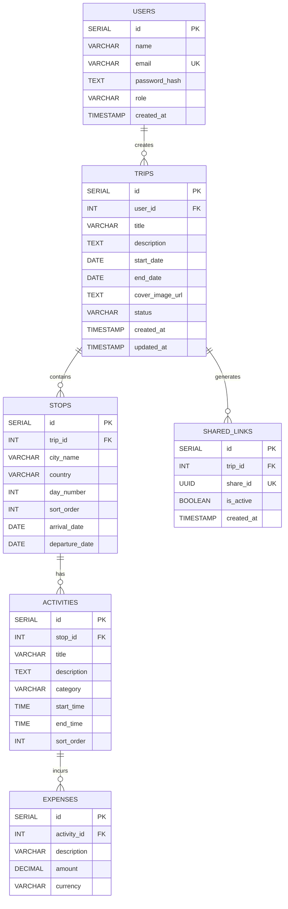

# 🗄️ Database Developer Guide — GlobeTrotter

> **Owner:** Dhairya (Frontend + Database Dev)
> This is your complete playbook for designing, creating, and seeding the PostgreSQL database.

---

## 📌 Tech Stack

| Tool | Purpose |
|------|---------|
| **PostgreSQL** | Local relational database (via pgAdmin / XAMPP) |
| **psql CLI** | Running SQL scripts |
| **pgAdmin** | Visual DB management and query testing |

---

## 🗂️ File Structure

```
database/
├── schema.sql       # All CREATE TABLE statements (run this FIRST)
├── seed.sql         # Sample data inserts for development/testing
└── erd.png          # Entity-Relationship Diagram image
```

---

## 📐 Entity-Relationship Diagram



### Relationship Summary

| Parent | Child | Relationship | ON DELETE |
|--------|-------|-------------|-----------|
| `users` | `trips` | One user creates many trips | CASCADE |
| `trips` | `stops` | One trip has many stops (cities) | CASCADE |
| `stops` | `activities` | One stop has many activities | CASCADE |
| `activities` | `expenses` | One activity has many expenses | CASCADE |
| `trips` | `shared_links` | One trip can have many share links | CASCADE |

---

## 📋 Build Checklist

### 🔴 P0 — Critical (09:00 - 10:00)

- [ ] **Install PostgreSQL** locally (if not already installed)
- [ ] **Create the database:**
  ```sql
  CREATE DATABASE globetrotter_db;
  ```
- [ ] **Write `schema.sql`** with all 6 tables (see below)
- [ ] **Run `schema.sql`:**
  ```bash
  psql -U postgres -d globetrotter_db -f database/schema.sql
  ```
- [ ] **Verify all tables exist:**
  ```sql
  \dt
  ```

### 🟡 P1 — Seed Data (10:00 - 12:30)

- [ ] **Write `seed.sql`** with realistic sample data (see below)
- [ ] **Run `seed.sql`:**
  ```bash
  psql -U postgres -d globetrotter_db -f database/seed.sql
  ```
- [ ] **Verify data with SELECT queries**
- [ ] **Create ERD image** (`erd.png`) using dbdiagram.io, pgAdmin ERD tool, or draw.io

### 🟢 P2 — Complex Queries & Optimization (12:30+)

- [ ] **Write and test the budget aggregation query** (used by `GET /api/trips/:id/budget`)
- [ ] **Write the full trip details query** (joins trips + stops + activities + expenses)
- [ ] **Verify CASCADE deletes** work correctly (delete a trip → all its data should be removed)
- [ ] **Test edge cases** — empty trips, trips with no activities, etc.

---

## 📜 Schema SQL (`database/schema.sql`)

```sql
-- ============================================
-- GlobeTrotter Database Schema
-- Run: psql -U postgres -d globetrotter_db -f database/schema.sql
-- ============================================

-- Drop tables if they exist (for clean re-runs)
DROP TABLE IF EXISTS shared_links CASCADE;
DROP TABLE IF EXISTS expenses CASCADE;
DROP TABLE IF EXISTS activities CASCADE;
DROP TABLE IF EXISTS stops CASCADE;
DROP TABLE IF EXISTS trips CASCADE;
DROP TABLE IF EXISTS users CASCADE;

-- 1. Users
CREATE TABLE users (
    id SERIAL PRIMARY KEY,
    name VARCHAR(100) NOT NULL,
    email VARCHAR(150) UNIQUE NOT NULL,
    password_hash TEXT NOT NULL,
    role VARCHAR(20) DEFAULT 'user',
    created_at TIMESTAMP DEFAULT CURRENT_TIMESTAMP
);

-- 2. Trips
CREATE TABLE trips (
    id SERIAL PRIMARY KEY,
    user_id INT NOT NULL REFERENCES users(id) ON DELETE CASCADE,
    title VARCHAR(200) NOT NULL,
    description TEXT,
    start_date DATE,
    end_date DATE,
    cover_image_url TEXT,
    status VARCHAR(20) DEFAULT 'draft',
    created_at TIMESTAMP DEFAULT CURRENT_TIMESTAMP,
    updated_at TIMESTAMP DEFAULT CURRENT_TIMESTAMP
);

-- 3. Stops (Cities within a trip)
CREATE TABLE stops (
    id SERIAL PRIMARY KEY,
    trip_id INT NOT NULL REFERENCES trips(id) ON DELETE CASCADE,
    city_name VARCHAR(200) NOT NULL,
    country VARCHAR(100),
    day_number INT,
    sort_order INT DEFAULT 0,
    arrival_date DATE,
    departure_date DATE
);

-- 4. Activities (Things to do at each stop)
CREATE TABLE activities (
    id SERIAL PRIMARY KEY,
    stop_id INT NOT NULL REFERENCES stops(id) ON DELETE CASCADE,
    title VARCHAR(200) NOT NULL,
    description TEXT,
    category VARCHAR(50),
    start_time TIME,
    end_time TIME,
    sort_order INT DEFAULT 0
);

-- 5. Expenses (Costs per activity)
CREATE TABLE expenses (
    id SERIAL PRIMARY KEY,
    activity_id INT NOT NULL REFERENCES activities(id) ON DELETE CASCADE,
    description VARCHAR(200),
    amount DECIMAL(10, 2) NOT NULL DEFAULT 0,
    currency VARCHAR(10) DEFAULT 'INR'
);

-- 6. Shared Links (Public trip sharing)
CREATE TABLE shared_links (
    id SERIAL PRIMARY KEY,
    trip_id INT NOT NULL REFERENCES trips(id) ON DELETE CASCADE,
    share_id UUID UNIQUE NOT NULL DEFAULT gen_random_uuid(),
    is_active BOOLEAN DEFAULT true,
    created_at TIMESTAMP DEFAULT CURRENT_TIMESTAMP
);

-- ============================================
-- Performance Indexes
-- ============================================
CREATE INDEX idx_trips_user_id ON trips(user_id);
CREATE INDEX idx_stops_trip_id ON stops(trip_id);
CREATE INDEX idx_activities_stop_id ON activities(stop_id);
CREATE INDEX idx_expenses_activity_id ON expenses(activity_id);
CREATE INDEX idx_shared_links_share_id ON shared_links(share_id);
```

---

## 🌱 Seed Data SQL (`database/seed.sql`)

```sql
-- ============================================
-- GlobeTrotter Seed Data
-- Run: psql -U postgres -d globetrotter_db -f database/seed.sql
-- ============================================

-- Note: password_hash below is bcrypt of "password123"
INSERT INTO users (name, email, password_hash, role) VALUES
('Dhairya Patel', 'dhairya@globetrotter.dev', '$2a$10$xJwL5v5Jz5UZqYqKQhOxe.Gkd8FjEfGMhV5H8CXZJ2XJ5q5q5q5q', 'user'),
('Parshwa Shah', 'parshwa@globetrotter.dev', '$2a$10$xJwL5v5Jz5UZqYqKQhOxe.Gkd8FjEfGMhV5H8CXZJ2XJ5q5q5q5q', 'user'),
('Admin User', 'admin@globetrotter.dev', '$2a$10$xJwL5v5Jz5UZqYqKQhOxe.Gkd8FjEfGMhV5H8CXZJ2XJ5q5q5q5q', 'admin');

-- Trip 1: Rajasthan Heritage Tour
INSERT INTO trips (user_id, title, description, start_date, end_date, status) VALUES
(1, 'Rajasthan Heritage Tour', 'Exploring the royal palaces and forts of Rajasthan', '2026-09-15', '2026-09-22', 'planned');

-- Stops for Trip 1
INSERT INTO stops (trip_id, city_name, country, day_number, sort_order, arrival_date, departure_date) VALUES
(1, 'Jaipur', 'India', 1, 1, '2026-09-15', '2026-09-17'),
(1, 'Jodhpur', 'India', 3, 2, '2026-09-17', '2026-09-19'),
(1, 'Udaipur', 'India', 5, 3, '2026-09-19', '2026-09-22');

-- Activities for Jaipur (stop_id = 1)
INSERT INTO activities (stop_id, title, description, category, start_time, end_time, sort_order) VALUES
(1, 'Amber Fort Visit', 'Explore the magnificent Amber Fort with elephant ride', 'sightseeing', '09:00', '12:00', 1),
(1, 'Hawa Mahal Photography', 'Visit the iconic Palace of Winds', 'sightseeing', '14:00', '15:30', 2),
(1, 'Jaipur Street Food Tour', 'Taste authentic Rajasthani cuisine at local markets', 'food', '18:00', '20:00', 3);

-- Activities for Jodhpur (stop_id = 2)
INSERT INTO activities (stop_id, title, description, category, start_time, end_time, sort_order) VALUES
(2, 'Mehrangarh Fort Tour', 'Guided tour of one of India''s largest forts', 'sightseeing', '08:00', '11:00', 1),
(2, 'Blue City Walking Tour', 'Walk through the famous blue-painted old city', 'adventure', '15:00', '17:00', 2);

-- Activities for Udaipur (stop_id = 3)
INSERT INTO activities (stop_id, title, description, category, start_time, end_time, sort_order) VALUES
(3, 'Lake Pichola Boat Ride', 'Sunset boat ride on the beautiful lake', 'adventure', '16:00', '18:00', 1),
(3, 'City Palace Museum', 'Tour the stunning lakeside palace complex', 'sightseeing', '10:00', '13:00', 2);

-- Expenses for activities
INSERT INTO expenses (activity_id, description, amount, currency) VALUES
(1, 'Fort Entry + Elephant Ride', 1500.00, 'INR'),
(1, 'Guide Fee', 500.00, 'INR'),
(2, 'Entry Ticket', 200.00, 'INR'),
(3, 'Street Food Tasting', 800.00, 'INR'),
(4, 'Fort Entry + Audio Guide', 600.00, 'INR'),
(5, 'Walking Tour Guide', 400.00, 'INR'),
(6, 'Boat Ride Ticket', 900.00, 'INR'),
(7, 'Palace Entry Ticket', 300.00, 'INR');

-- Trip 2: Europe Backpacking
INSERT INTO trips (user_id, title, description, start_date, end_date, status) VALUES
(1, 'Europe Backpacking 2026', 'Backpacking through Western Europe on a budget', '2026-12-01', '2026-12-15', 'draft');

-- Stops for Trip 2
INSERT INTO stops (trip_id, city_name, country, day_number, sort_order, arrival_date, departure_date) VALUES
(2, 'Paris', 'France', 1, 1, '2026-12-01', '2026-12-05'),
(2, 'Amsterdam', 'Netherlands', 5, 2, '2026-12-05', '2026-12-08'),
(2, 'Berlin', 'Germany', 8, 3, '2026-12-08', '2026-12-12'),
(2, 'Prague', 'Czech Republic', 12, 4, '2026-12-12', '2026-12-15');

-- Activities for Paris (stop_id = 4)
INSERT INTO activities (stop_id, title, description, category, start_time, end_time, sort_order) VALUES
(4, 'Eiffel Tower Visit', 'Visit the iconic iron tower with summit access', 'sightseeing', '10:00', '13:00', 1),
(4, 'Louvre Museum', 'Half-day tour of the world''s largest art museum', 'sightseeing', '14:00', '18:00', 2),
(4, 'Seine River Cruise', 'Evening cruise along the Seine', 'adventure', '19:00', '21:00', 3);

-- Expenses for Europe trip activities
INSERT INTO expenses (activity_id, description, amount, currency) VALUES
(8, 'Summit Access Ticket', 26.80, 'EUR'),
(9, 'Museum Entry', 17.00, 'EUR'),
(10, 'Cruise Ticket', 15.00, 'EUR');

-- Shared link for Trip 1
INSERT INTO shared_links (trip_id) VALUES (1);
```

---

## 🔍 Important Queries (For Backend Dev Reference)

### Get Full Trip Details (with stops, activities, expenses)
```sql
SELECT
    t.id AS trip_id, t.title, t.description, t.start_date, t.end_date, t.status,
    s.id AS stop_id, s.city_name, s.country, s.day_number, s.arrival_date, s.departure_date,
    a.id AS activity_id, a.title AS activity_title, a.category, a.start_time, a.end_time,
    e.id AS expense_id, e.description AS expense_desc, e.amount, e.currency
FROM trips t
LEFT JOIN stops s ON s.trip_id = t.id
LEFT JOIN activities a ON a.stop_id = s.id
LEFT JOIN expenses e ON e.activity_id = a.id
WHERE t.id = $1 AND t.user_id = $2
ORDER BY s.sort_order, a.sort_order;
```

### Get Budget Breakdown for a Trip
```sql
SELECT
    s.city_name,
    a.category,
    SUM(e.amount) AS category_total
FROM trips t
JOIN stops s ON s.trip_id = t.id
JOIN activities a ON a.stop_id = s.id
JOIN expenses e ON e.activity_id = a.id
WHERE t.id = $1 AND t.user_id = $2
GROUP BY s.city_name, a.category
ORDER BY s.city_name, category_total DESC;
```

### Get Trip Summary (for trip list page)
```sql
SELECT
    t.*,
    COUNT(DISTINCT s.id) AS stop_count,
    COUNT(DISTINCT a.id) AS activity_count,
    COALESCE(SUM(e.amount), 0) AS total_budget
FROM trips t
LEFT JOIN stops s ON s.trip_id = t.id
LEFT JOIN activities a ON a.stop_id = s.id
LEFT JOIN expenses e ON e.activity_id = a.id
WHERE t.user_id = $1
GROUP BY t.id
ORDER BY t.created_at DESC;
```

### Admin Dashboard Stats
```sql
-- Total users, trips, activities
SELECT
    (SELECT COUNT(*) FROM users) AS total_users,
    (SELECT COUNT(*) FROM trips) AS total_trips,
    (SELECT COUNT(*) FROM activities) AS total_activities;

-- Top 5 most visited cities
SELECT city_name, country, COUNT(*) AS visit_count
FROM stops
GROUP BY city_name, country
ORDER BY visit_count DESC
LIMIT 5;
```

---

## ⚠️ Key Rules to Follow

1. **Local PostgreSQL ONLY** — No Firebase, Supabase, or MongoDB.
2. **Parameterized queries** — Always use `$1, $2` placeholders. NEVER concatenate user input into SQL strings.
3. **CASCADE deletes** — Deleting a user removes all their trips, stops, activities, and expenses automatically.
4. **Indexes** — Already included in the schema for all foreign keys and the `share_id` column.
5. **Realistic seed data** — Use real city names, realistic prices, and proper date ranges. No "test123" garbage.
6. **Test everything** — Run SELECT queries after seeding to verify data integrity before handing off to backend dev.
